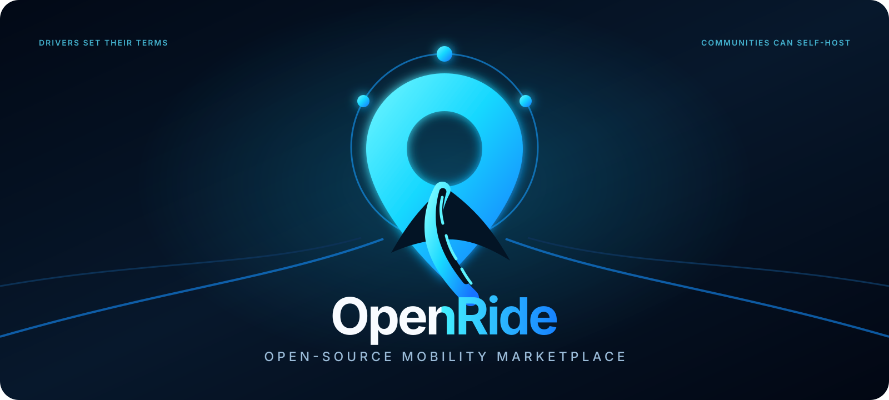
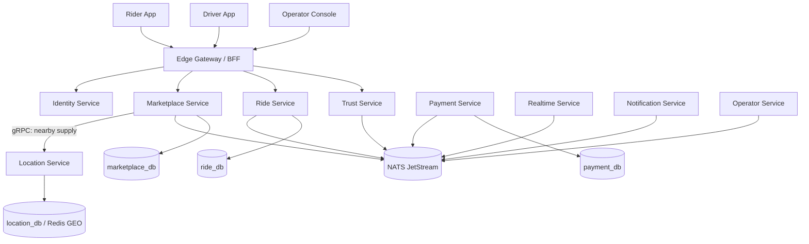

<div align="center">



# OpenRide

### Open-source mobility marketplace infrastructure

**Drivers set their terms. Riders choose. Algorithms connect. Communities can self-host.**

**English** · [简体中文](README.zh-CN.md) · [हिन्दी](README.hi.md) · [Español](README.es.md)

[](LICENSE)


**[Why](#why-openride) · [Status](docs/PROJECT_STATUS.md) · [Architecture](#microservices-architecture) · [Try it](#try-it) · [Packages](#packageable-by-design) · [Contribute](CONTRIBUTING.md)**

</div>

---

## What if ride-hailing were infrastructure instead of a gatekeeper?

OpenRide is **not another Grab/Uber clone**. It is an open-source foundation for driver communities, cooperatives, local operators and startups to run mobility marketplaces without rebuilding the entire technical stack from zero.

The marketplace relationship is explicit:

```text
Rider creates demand
        ↓
Drivers offer their terms
        ↓
OpenRide ranks transparently
        ↓
Rider chooses — or Quick Match chooses within rider constraints
        ↓
Agreement snapshots accepted terms
        ↓
Ride executes the agreement
```

A platform may recommend. It must not silently rewrite what the two sides agreed to.

> **Implementation reality, not diagramware:** Core, first-party modules, contracts, the JS/TS SDK and an independently deployable Marketplace Service process exist today. The Marketplace persistence schema is foundational; full durable request → quote → agreement execution, Outbox relay, Location Service and Ride Service are not complete yet. See [`docs/PROJECT_STATUS.md`](docs/PROJECT_STATUS.md) for the status matrix.

## Why OpenRide

Each driver owns their own tariff. Pricing is **not a country-wide driver price**. Country/instance configuration may define currency, legal constraints or safety limits, while every driver independently declares commercial terms such as `per_km`.

For the same 10 km request:

```text
Driver A  →  5,000 VND/km  →  50,000 VND  →  pickup in 10 min
Driver B  →  6,000 VND/km  →  60,000 VND  →  pickup in  3 min
Driver C  →  5,500 VND/km  →  55,000 VND  →  pickup in  6 min
```

OpenRide does **not** reduce the marketplace to `sort(price ASC)`.

A rider can understand the trade-off between fare, pickup ETA, quality, reliability and preferences. A driver can use manual, automatic or hybrid quoting inside limits they control. Ranking must explain its reasons, and Core prevents ranking plugins from mutating canonical quote terms.

### Non-negotiable principles

1. **Drivers control their commercial terms, including their own per-km price.**
2. **Riders keep the final choice.**
3. **Cheapest must not automatically mean best.**
4. **Declining an unsuitable request is not automatically bad behavior.**
5. **Accepted terms are snapshotted and cannot be silently changed.**
6. **Pricing and ranking must be explainable.**
7. **OpenRide remains self-hostable and operator-independent.**

Read the [`OpenRide Manifesto`](docs/OPENRIDE_MANIFESTO.md).

## Microservices architecture

OpenRide uses **microservices at deployment boundaries** and clean/hexagonal boundaries inside each service.



The diagram is the **target service topology**. Only extracted/implemented services are marked as such in [`PROJECT_STATUS`](docs/PROJECT_STATUS.md); OpenRide does not create empty service folders just to make the diagram look complete.

### Hard service rules

```text
one service → one bounded context
each service owns its data + migrations
no cross-service database queries
no cross-service database foreign keys
sync internal calls → gRPC only when an immediate answer is required
async integration → NATS JetStream
state change + event → transactional outbox
consumer side effects → inbox/idempotency
multi-service workflows → Saga / process manager
public traffic → Edge Gateway / BFF
```

A shared PostgreSQL **cluster** is acceptable for small deployments. A shared logical database with services reading each other's tables is not.

See [`docs/MICROSERVICES_ARCHITECTURE.md`](docs/MICROSERVICES_ARCHITECTURE.md).

## First extracted service: Marketplace

`services/marketplace` is the first independently deployable V2 domain service.

Its bounded context owns the target model for:

```text
MobilityRequest
DriverTariff
Quote
Marketplace ranking orchestration
Agreement
Service-module catalog and validation
Outbox / Inbox records
```

Today the process exposes health/readiness, first-party service catalog and request validation. Initial Marketplace-owned schema exists, but the complete durable request/quote/agreement API is still being implemented. The legacy `services/api` remains a **compatibility gateway/runtime** during extraction; new marketplace ownership belongs in `marketplace-service`, not in the gateway.

## Packageable by design

```text
packages/
├── core-go/       portable marketplace kernel + invariants
├── modules-go/    first-party mobility service modules
├── contracts/     versioned language-neutral schemas
└── sdk/           zero-dependency JavaScript/TypeScript client
```

Core owns invariants such as:

```text
Request → Quote → Agreement → Ride
money uses integer minor units
each driver owns their tariff
accepted commercial terms are immutable snapshots
ranking may score/reorder but cannot rewrite quotes
```

### Service modules

```text
passenger.car        ✅
carpool.intercity    ✅
passenger.motorbike  planned
parcel.instant       planned
designated-driver    planned
vehicle-assistance   planned
your.community.*     extensible
```

### JavaScript / TypeScript SDK

```js
import { OpenRideClient } from '@openride/sdk';

const openride = new OpenRideClient({
  baseURL: 'https://api.example.com',
  token: session.accessToken,
});

const request = await openride.createRequest({
  service_type: 'passenger.car',
  pickup: { lat: 19.8067, lng: 105.7852 },
  destination: { lat: 19.7724, lng: 105.7762 },
}, { idempotencyKey: crypto.randomUUID() });
```

The SDK uses the Web Fetch API and has zero runtime dependencies. Some V2 SDK methods target the documented contract ahead of complete server-side implementation; the status matrix is authoritative for runtime availability.

## Marketplace guardrails

Ranking is a policy extension — **not a place to mutate commercial truth**. OpenRide Core rejects rankers that attempt to hide valid offers, fabricate/duplicate offers, change commercial terms, return invalid scores, omit explanations or mark multiple offers as the single recommendation.

## Event-driven reliability

```text
DB transaction
  ├── change owned domain state
  └── append outbox event
COMMIT
      ↓
outbox relay
      ↓
NATS JetStream
      ↓
consumer inbox dedupe
      ↓
consumer-owned state change
```

Initial Outbox/Inbox schema and NATS development topology exist. The production Outbox relay and complete consumer/Saga coverage are not complete yet.

## Repository map

```text
OpenRide/
├── apps/            rider / driver / admin / landing
├── packages/        core-go / modules-go / contracts / sdk
├── services/        compatibility api / marketplace
├── infrastructure/
├── docs/
└── go.work
```

## Try it

```bash
make packages-test
make core-example
make marketplace-test
make marketplace-run
```

Microservices development stack:

```bash
make micro-config
make micro-up
make micro-logs
make micro-down
```

## Documentation

Documentation follows the same four-language policy as the README: **English, Simplified Chinese, Hindi and Spanish**. See [`docs/README.md`](docs/README.md) for the language index and translation-status rules. English is the canonical technical source when translations temporarily lag behind a code change.

Key documents:

- [`PROJECT_STATUS`](docs/PROJECT_STATUS.md)
- [`PRODUCT_VISION`](docs/PRODUCT_VISION.md)
- [`OPENRIDE_MANIFESTO`](docs/OPENRIDE_MANIFESTO.md)
- [`MICROSERVICES_ARCHITECTURE`](docs/MICROSERVICES_ARCHITECTURE.md)
- [`PACKAGE_ARCHITECTURE`](docs/PACKAGE_ARCHITECTURE.md)
- [`API_CONTRACT_V2`](docs/API_CONTRACT_V2.md)

## Project status

OpenRide is **pre-1.0**. It does not claim production readiness for carrying real passengers yet. See [`docs/PROJECT_STATUS.md`](docs/PROJECT_STATUS.md) for the capability matrix.

## Contributing

OpenRide is being built as a commons, not source code only one company understands. Start with [`CONTRIBUTING.md`](CONTRIBUTING.md).

## License

OpenRide is licensed under **GNU AGPL-3.0-or-later**. See [`LICENSE`](LICENSE).

---

<div align="center">

### Build infrastructure for mobility communities — not another closed platform they depend on.

⭐ Star the repository · 🧩 Build a module · 🛠️ Run your own operator · 🤝 Contribute a better marketplace

</div>
