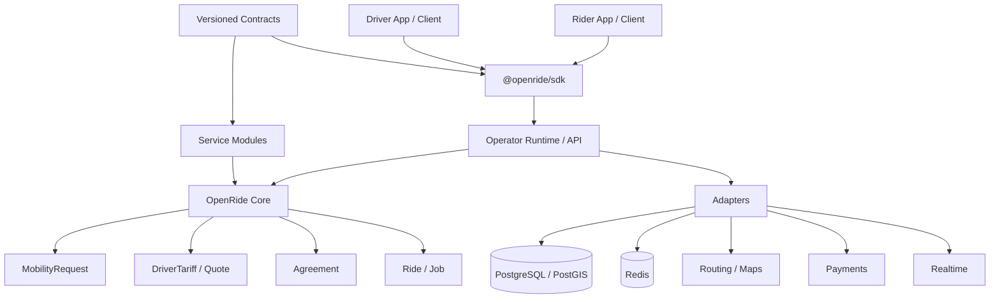
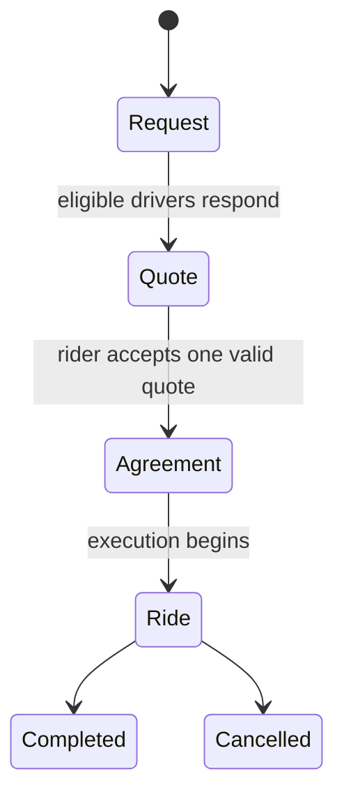

<div align="center">

# 🚕 OpenRide

### Open-source mobility marketplace infrastructure

**Drivers set their terms. Riders choose. Algorithms connect. Communities can self-host.**

[](LICENSE)


**[Why OpenRide](#why-openride) · [Architecture](#architecture) · [Try it](#try-it-in-2-minutes) · [Packages](#packageable-by-design) · [Contributing](CONTRIBUTING.md)**

</div>

---

## What if ride-hailing were infrastructure instead of a gatekeeper?

OpenRide is **not another Grab/Uber clone**. It is a packageable, self-hostable foundation for driver communities, cooperatives, local operators and startups to build mobility marketplaces without rebuilding routing, matching, realtime, trust and marketplace primitives from zero.

The commercial relationship is modeled explicitly:

```text
Rider creates demand
        ↓
Drivers offer terms
        ↓
OpenRide ranks transparently
        ↓
Rider chooses / Quick Match chooses within rider constraints
        ↓
Agreement snapshots accepted terms
        ↓
Ride executes the agreement
```

A platform may recommend. It must not silently rewrite what the two sides agreed to.

## Why OpenRide

Imagine the same 10 km trip:

```text
Driver A  →  50,000 VND  →  pickup in 10 min
Driver B  →  60,000 VND  →  pickup in  3 min
Driver C  →  55,000 VND  →  pickup in  6 min
```

OpenRide does **not** reduce this to `sort(price ASC)`.

A rider can understand the trade-off between price, ETA, reliability, quality and preferences. A driver can run manual, automatic or hybrid quoting inside limits they control. Ranking must provide reasons, and Core prevents ranking plugins from mutating canonical quote terms.

### Non-negotiable principles

1. **Drivers control their commercial terms.**
2. **Riders keep the final choice.**
3. **Cheapest must not automatically mean best.**
4. **Declining an unsuitable request is not automatically bad behavior.**
5. **Accepted terms are snapshotted and cannot be silently changed.**
6. **Pricing and ranking must be explainable.**
7. **OpenRide Core remains self-hostable and operator-independent.**

Read the full [`OpenRide Manifesto`](docs/OPENRIDE_MANIFESTO.md).

## Architecture



The boundary is deliberate:

```text
Core owns invariants.
Modules own vertical-specific behavior.
Adapters own infrastructure.
Operator runtime composes everything.
Contracts keep languages interoperable.
```

## Packageable by design

```text
packages/
├── core-go/       portable marketplace kernel
├── modules-go/    first-party service modules
├── contracts/     versioned JSON Schemas
└── sdk/           zero-dependency JS/TS Marketplace V2 client
```

| Package | Purpose | Coupled to operator runtime? |
|---|---|---|
| `core-go` | Money, geo, request, tariff, quote, agreement, ride, engine, ranking/pricing ports | **No** |
| `modules-go` | `passenger.car`, `carpool.intercity`, future mobility verticals | **No** |
| `contracts` | Language-neutral service/event/request schemas | **No** |
| `@openride/sdk` | Browser/Node/edge client for Marketplace V2 | **No** |
| `services/api` | Current Go operator runtime and adapters | Yes — this is the composition layer |

### OpenRide Core

Import the kernel without adopting the full server:

```go
import (
    "github.com/0xmarkhydra/OpenRide/packages/core-go/engine"
    "github.com/0xmarkhydra/OpenRide/packages/core-go/marketplace"
    "github.com/0xmarkhydra/OpenRide/packages/core-go/ranking"
)
```

Core has no PostgreSQL, Redis, HTTP, WebSocket, map-provider, payment-provider or cloud SDK dependency.

Infrastructure is injected through ports such as:

```go
type CandidateSource interface { /* discover eligible supply */ }
type QuoteProvider interface { /* produce driver-authorized quotes */ }
type Ranker interface { /* order + explain, never rewrite terms */ }
type EventPublisher interface { /* publish marketplace events */ }
```

### Service modules

Mobility verticals plug in instead of expanding one giant `if service == ...` tree:

```text
passenger.car
carpool.intercity
parcel.instant            # future
passenger.motorbike       # future
designated-driver.car     # future
vehicle-assistance        # future
your.community.service    # yours
```

`carpool.intercity` already proves that a module can define its own request attributes and ride lifecycle without changing the marketplace kernel.

### JavaScript / TypeScript SDK

```js
import { OpenRideClient } from '@openride/sdk';

const openride = new OpenRideClient({
  baseURL: 'https://api.example.com',
  token: session.accessToken,
});

const request = await openride.createRequest({
  service_type: 'passenger.car',
  pickup: { lat: 19.8067, lng: 105.7852 },
  destination: { lat: 19.7724, lng: 105.7762 },
}, { idempotencyKey: crypto.randomUUID() });

const offers = await openride.listOffers(request.id);
```

The SDK has **zero runtime dependencies** and uses the Web Fetch API, so applications can provide their own fetch implementation.

## Try it in 2 minutes

### 1. Test package boundaries

```bash
make packages-test
```

This independently validates:

```text
Core → service modules → contracts → JS/TS SDK
```

### 2. Run the portable marketplace example

```bash
make core-example
```

The example discovers several drivers, requests driver-authorized offers and runs an explainable ranking policy.

### 3. Run the operator API

```bash
make api-run
```

Then inspect the additive V2 layer:

```text
GET http://localhost:8080/v2
GET http://localhost:8080/v2/services
```

V1 compatibility routes remain available while Marketplace V2 replaces them incrementally.

## Marketplace model



The separation matters:

- **Request** — what the rider needs.
- **DriverTariff** — a driver's declared commercial policy.
- **Quote** — what a driver is willing to do a specific request for.
- **Agreement** — an immutable snapshot of accepted terms.
- **Ride / Job** — execution of the agreement.

A ride is not the marketplace. It is the result of a marketplace agreement.

## Driver-controlled pricing

A tariff can model more than one `price_per_km` number:

```text
base / minimum fare
per-km rate
per-minute rate
pickup fee / radius
long-distance rules
night / holiday rules
auto quote minimum
auto quote maximum
manual / auto / hybrid quote mode
```

Default pricing uses integer minor-unit arithmetic. Money is not calculated using floating point.

### Manual
Driver reviews each request and sends a quote.

### Auto
Core may generate a quote only inside driver-authorized bounds.

### Hybrid
The system prepares a suggestion and the driver can change it before sending.

## Ranking guardrails

Ranking is a policy extension, not a place to mutate commercial truth.

OpenRide Core rejects rankers that attempt to:

```text
hide a valid offer
fabricate or duplicate an offer
change fare / driver / expiry
return NaN or infinite scores
omit explanation reasons
mark multiple offers as the single recommendation
```

After ranking, Core restores canonical quote data before returning results.

## Cross-language contracts

`packages/contracts` currently publishes versioned shapes for:

```text
service-manifest.v1
marketplace-event.v1
request.passenger-car.v1
request.carpool-intercity.v1
```

Breaking wire changes create new versions instead of silently changing existing meanings. This is the foundation for future Dart, Rust, Python and generated SDKs.

## Current applications and runtime

The repository also retains the existing product foundation while the business kernel migrates:

- Rider app — Flutter
- Driver app — Flutter
- Operator/Admin — Next.js + TypeScript
- API runtime — Go modular monolith
- PostgreSQL + PostGIS
- Redis
- WebSocket realtime
- auth, ratings, payments and object storage foundations
- routing provider abstraction

We intentionally do **not** split everything into microservices just to look enterprise. Modules should be extracted only when scaling, ownership or deployment requirements justify it.

## Repository map

```text
OpenRide/
├── apps/
│   ├── rider/
│   ├── driver/
│   ├── admin/
│   └── landing/
├── packages/
│   ├── core-go/
│   ├── modules-go/
│   ├── contracts/
│   └── sdk/
├── services/
│   └── api/
│       └── internal/openridecore/   # bridge from runtime to packageable Core/modules
├── infrastructure/
│   └── migrations/
├── docs/
└── go.work
```

## Migration strategy

No big-bang rewrite.

```text
Legacy Trip / Pricing / Dispatch
             │
             │ compatibility
             ▼
        Operator Runtime
             │
             ▼
        OpenRide Core
             │
     ┌───────┼────────┐
     ▼       ▼        ▼
 Request   Quote   Agreement
                      │
                      ▼
                     Ride
```

Existing V1 flows stay alive until the V2 replacement for that capability is tested. Legacy `flashx` technical identifiers are documented in [`docs/LEGACY_COMPATIBILITY.md`](docs/LEGACY_COMPATIBILITY.md) and are not the target product identity.

## Read the design

- [`PRODUCT_VISION`](docs/PRODUCT_VISION.md)
- [`OPENRIDE_MANIFESTO`](docs/OPENRIDE_MANIFESTO.md)
- [`PACKAGE_ARCHITECTURE`](docs/PACKAGE_ARCHITECTURE.md)
- [`ARCHITECTURE`](docs/ARCHITECTURE.md)
- [`DOMAIN_MODEL`](docs/DOMAIN_MODEL.md)
- [`DATA_MODEL`](docs/DATA_MODEL.md)
- [`API_CONTRACT_V2`](docs/API_CONTRACT_V2.md)
- [`OPENRIDE_MIGRATION_PLAN_V2`](docs/OPENRIDE_MIGRATION_PLAN_V2.md)
- [`ADR_OPENRIDE_V2`](docs/ADR_OPENRIDE_V2.md)

## Development

```bash
# Portable packages
make core-test
make modules-test
make contracts-test
make sdk-test
make packages-test

# API/runtime
make api-test
make api-run

# Everything package + API
make workspace-test

# Full local infrastructure/application stack
make stack-up
make stack-ps
make stack-logs
make stack-down
```

## Project status

OpenRide is **pre-1.0**. The package/kernel architecture is intentionally usable now, but the repository does not claim production readiness for carrying real passengers.

Before a real-world operator launches, it must validate local legal requirements, insurance, KYC, payments, incident response, fraud prevention, privacy, safety and operational processes.

## Contributing

OpenRide is being built as a commons, not as source code that only one company understands.

Start with [`CONTRIBUTING.md`](CONTRIBUTING.md). Architecture contributions should explain their impact on:

```text
driver autonomy
rider choice
algorithm transparency
safety
self-hostability
backward compatibility
```

Security vulnerabilities should follow [`SECURITY.md`](SECURITY.md). Community participation follows [`CODE_OF_CONDUCT.md`](CODE_OF_CONDUCT.md).

## License

OpenRide is licensed under **GNU AGPL-3.0-or-later**. See [`LICENSE`](LICENSE).

The copyleft choice is intentional: improvements to a modified network-hosted OpenRide Core should remain available to the community under the license terms.

---

<div align="center">

### Build infrastructure for mobility communities — not another closed platform they depend on.

⭐ Star the repository · 🧩 Build a module · 🛠️ Run your own operator · 🤝 Contribute a better marketplace

</div>
